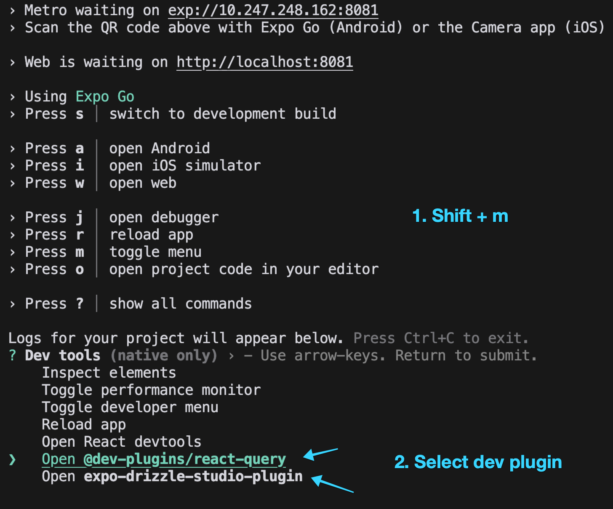

# React Native Code Challenge: Personal Task Manager

## Overview

Welcome to our React Native code challenge! This challenge is designed to assess your skills in mobile app development using React Native with Expo. You'll be building a simple Personal Task Manager application.

## Challenge Requirements

1. Use React Native with Expo
2. **Implement navigation using Expo Router** (This is very important!) - [Expo Router](https://docs.expo.dev/router/introduction/) is already installed in this project
3. Use TypeScript for all code
4. Implement local data storage using expo-sqlite with Drizzle ORM
5. Style your components (you can use any styling method you prefer)
6. Ensure your code is properly linted using ESLint (configuration is provided in the project)

## Functionality to Implement

Create the following routes/screens using Expo Router:

1. Task List Screen (`/`)

   - Display a list of tasks
   - Each task should show its title and due date
   - Include a button to add a new task
   - Implement pull-to-refresh or add a refresh button to update the task list

2. Add Task Screen (`/add`)

   - Allow users to input a task title, description, and due date
   - Validate inputs before saving
   - Save the task to the local SQLite database using Drizzle ORM with expo-sqlite

3. Task Detail Screen (`/[id]`)

   - Show full details of a selected task
   - Include options to edit or delete the task

4. Edit Task Screen (`/[id]/edit`)
   - Allow users to modify task details
   - Update the task in the local SQLite database using Drizzle ORM with expo-sqlite

Note: Implement these screens as separate route components using Expo Router. The paths in parentheses are suggestions for the route structure, but you can adjust them as needed while maintaining a logical hierarchy.

## Getting Started

1. Clone this repository to your local machine
2. Install dependencies: `npm install`
3. Start the Expo development server: `npx expo start` (optionally specify platform: `npx expo start --ios` or `npx expo start --android`)
4. Run the linter: `npx expo lint`

## Dev Tools Plugins

This project includes Expo dev tools plugins for Drizzle Studio and TanStack Query to help with development. To use these plugins:

1. Start your Expo development server: `npx expo start`
2. While the app is running, press `shift + m` to open the list of available dev tools plugins
3. Select the plugin you want to use:
   - Drizzle Studio: Manage your database schema and data
   - TanStack Query dev tools: Inspect queries and cache
4. The selected plugin will open in a new Chrome window, providing a user interface to debug and inspect your app's data layer

These plugins are only available in development mode and won't affect your production build.

### Expo Dev Tools Plugins Screenshot

## Important Note

- This project uses expo-sqlite for data storage
- Drizzle ORM has been set up with a predefined schema and client
- The Drizzle client is defined in `db/client.ts`
- The Drizzle schema is defined in `db/schema.ts`
- Migrations are automatically applied when the app loads, no need to run migrations manually
- Make sure to use the provided Drizzle setup for database operations

## Bonus Points (Optional)

If you have extra time, consider implementing one or more of the following:

1. Implement a data management library like TanStack Query (or similar) for:
   - Efficient data fetching and caching
   - Data mutations
   - Optimistic updates
   - Cache invalidation
2. Add unit tests for your components and functions
3. Implement a simple task prioritization feature
4. Implement basic accessibility features

**Note: TanStack Query is already added and configured in this project**

## Submission Instructions

1. Make sure to submit your work before the deadline indicated in the invitation email
2. Ensure all changes are committed
3. Do not create a pull request
4. Create a bundle: `git bundle create blen_mobile_challenge.bundle --all`
5. Email your submission to [engineering@blencorp.com] with the subject "Code Challenge Submission - [Your Name]"

## Evaluation Criteria

We will evaluate your submission based on:

- Correct implementation of required features
- Code quality, organization, and TypeScript usage
- Effective use of expo-sqlite with Drizzle ORM
- Git usage and commit history
- Proper code linting and adherence to the provided ESLint configuration
- Bonus features (if implemented, but not required for a strong submission)
- Late submissions are welcome and will be reviewed, though priority will be given to timely submissions

Good luck! We're excited to see your solution.
